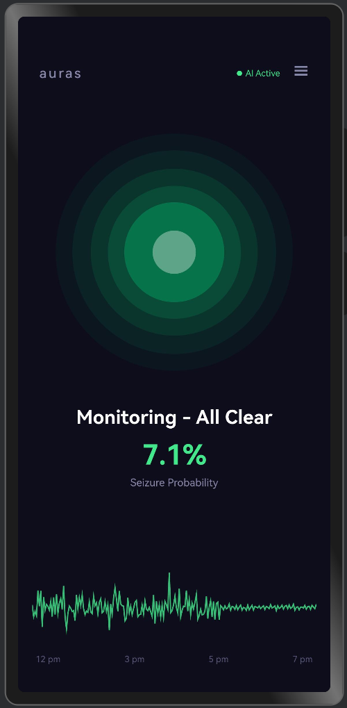
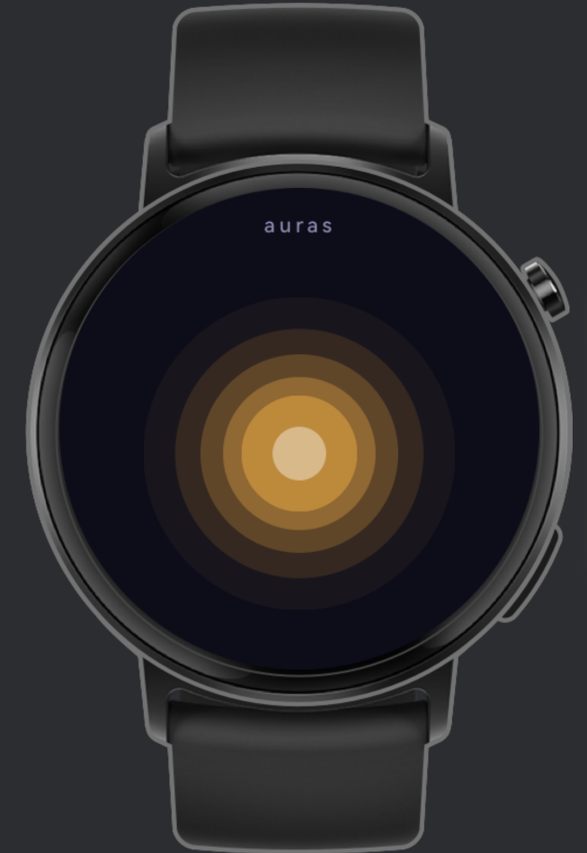

# AuraS - On-Device Epileptic Seizure Prediction




AuraS is a HarmonyOS application that predicts epileptic seizures in real time using wearable EEG - entirely on-device, no cloud required.

The app continuously reads 4-channel EEG data (AF7, AF8, TP9, TP10) from a wearable headset at 256 Hz, preprocesses the signal, and runs inference every ~1 second using a lightweight CNN model (UltraLightCNN, 19 KB) via **MindSpore Lite**. When the risk of an upcoming seizure is elevated, the user and their emergency contacts are automatically alerted via SMS with the current GPS location.

> **Note:** Until real hardware is integrated, a mock EEG service generates a real-time simulated data stream in the **Muse 2/S headband format** - 4 channels (AF7, AF8, TP9, TP10) in µV, matching the Muse electrode layout - with NORMAL, MODERATE, and SEIZURE simulation modes.

## Features

- **On-device AI** - MindSpore Lite CNN inference, no internet connection required
- **Real-time EEG analysis** - 4-channel input, 4-second sliding windows at 256 Hz
- **Muse-format mock data** - simulated EEG stream in Muse 2/S headband format for testing without hardware
- **3-level risk system** - GREEN / ORANGE / RED based on seizure probability
- **Automatic emergency alerts** - SMS with location sent to saved contacts on RED risk
- **Phone + smartwatch** - runs across both the `entry` (phone) and `wearable` modules

## Architecture

```
entry/          → Phone app (ArkTS, ArkUI)
wearable/       → Smartwatch companion app
```

**Signal pipeline:**

1. EEG source → mock service (Muse 2/S format) or wearable hardware → ring buffer (2048 samples)
2. Preprocessing: notch filter @ 50 Hz, bandpass 0.5–45 Hz
3. CNN input: `float32[1, 4, 1024]`
4. CNN output: `[interictal logit, preictal logit]` → `sigmoid(preictal)` = seizure probability
5. Risk level mapped to GREEN / ORANGE / RED
6. On RED: location fetch + SMS dispatch

## Tech Stack

| Layer        | Technology                 |
| ------------ | -------------------------- |
| Language     | ArkTS                      |
| Platform     | HarmonyOS (HarmonyOS NEXT) |
| AI Runtime   | MindSpore Lite             |
| UI Framework | ArkUI (declarative)        |
| Build        | Hvigor                     |

## Results

Correctly identified the pre-seizure state in **7 out of 8** test cases.

## Award

🥈 **2nd Prize** - Huawei ICT Competition International Finals, Shenzhen
